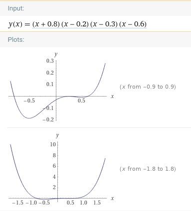

# Aufgabe/Fragestellung

Stellen Sie die Größe des Netzwerkes und die Anzahl der Trainingsdaten so ein, dass Sie die Phänomene Under-Fitting und Over-Fitting simulieren können.

Experimentieren Sie mit der Netzwerkarchitektur und den Parametern der Neuronen und des Lernalgorithmus:

Anzahl der hidden Layer und Neuron
Initialisierung der Gewichte
Aktivierungsfunktionen
Lernrate und Optimizer
Anzahl der Trainings Epochs
Was ist das beste Ergebnis dass Sie erzielen können?  Dokumentieren und begründen Sie Ihre Parameter und Einstellungen. Erklären Sie in diesem Zusammenhang die Begriffe Bias und Variance.

## ***Reellwertigen Funktion***

## ***Bestsettings***

### ***Parameter:***

* dataset size: Dataset 4 Size: 1000 Range: -1.8 to 1.8
* batch size: 100
* epoch: 200
* neuron count: 100
* hidden layer: 5
* activation: relu
* optimizer: adam
* learning rate: .01

## Under-Fitting und Over-Fitting

## ***Under-Fitting***

Under-Fitting kann auftreten wenn relevante Daten/Variablen beim Training nicht berücksichtigt werden. Daraus folgt eine hohe Bias, durch die keine entsprechenden Verknüpfungen zwischen Eingabe und Ausgabe hergestelllt werden können. Im den unten stehenden Einstellungen ist das Datenset zu klein definiert um so mit ein Underfitting zu erzeugen.

### ***Parameter:***

* trainings dataset: Dataset 2 Size: 100 Range: -1.8 to 1.8
* batch size: 32
* epoch: 10
* neuron count: 1
* hidden layer: 1
* activation: none
* optimizer: sgd
* learning rate: .01

## ***Over-Fitting***

Overfitting bezeichnet eine bestimmte Korrektur eines Modells an einen vorgegebenen Datensatz. In der Statistik bedeutet Überanpassung die Spezifizierung eines Modells, das zu viele erklärende Variablen enthält

### ***Parameter:***

* dataset size: Dataset 3 Size: 100 Range: 0 to 1.8
* batch size: 32
* epoch: 500
* neuron count: 100
* hidden layer: 25
* activation: none
* optimizer: sgd
* learning rate: .001

Ergebnis ca. .025

## ***Bias und Variance***

### ***Bias***

Die Bias ist der Fehler ausgehend von falschen Annahmen im Lernalgorithmus. Eine hohe Bias kann dazu führen, dass nicht die entsprechenden Verknüpfungen zwischen Eingabe und Ausgabe hergestellt werden. Daraus folgt Under-Fitting.

### ***Variance***

Die Varianz ist der Fehler ausgehend von der Empfindlichkeit auf kleinere Schwankungen in den Trainingsdaten. Eine hohe Varianz verursacht Überanpassung: es wird das Rauschen in den Trainingsdaten statt der vorgesehenen Ausgabe modelliert.

## ***Batch size***

Die "Batch size" ist im Zusammenhang mit der Anzahl der Trainingsdaten zu betrachten. Eine zu kleine gewählten "Batch size" kann dazu führen das die "Loss" Funktion größere schwankungen enthält was wiederum dazu führt das der Trainingsprozess mehr Zeit benötigt.